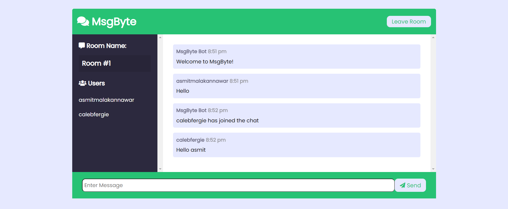

# MsgByte Chat App
Realtime chat app with websockets using Node.js, Express and Socket.io with Vanilla JS on the frontend with a custom UI.

## Usage
```
npm install
npm run dev

Go to localhost:3000
```

## Screenshots

 

 
